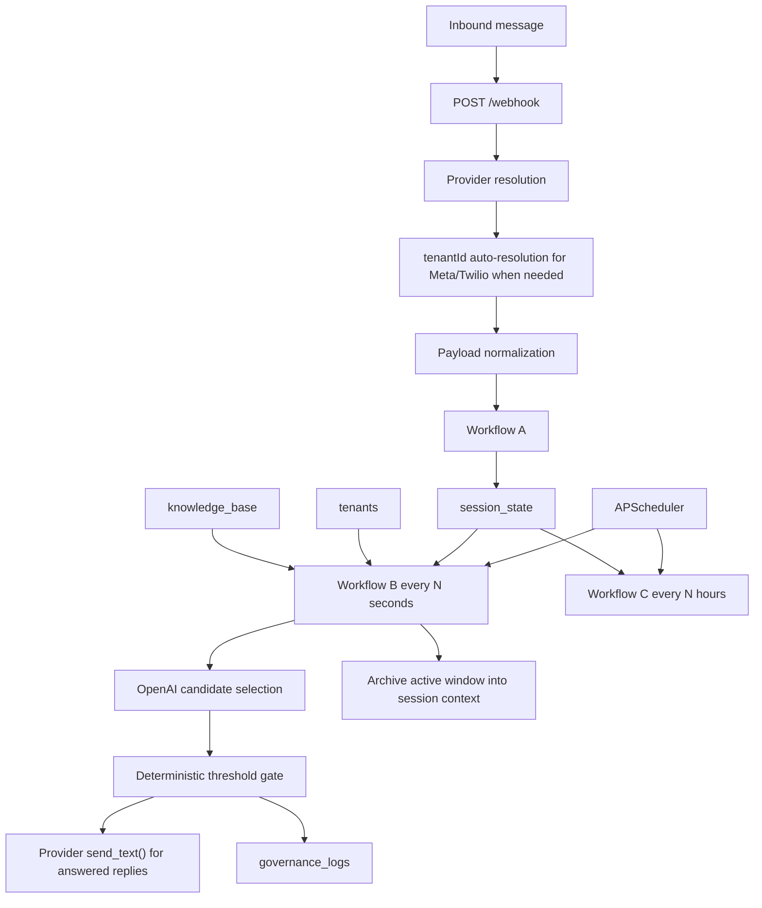

# SVMP System Architecture

## Purpose

SVMP is a Mongo-backed FastAPI service for tenant-scoped WhatsApp support automation.

In the current workspace, the running system:

- accepts inbound WhatsApp messages through a provider-aware webhook
- normalizes normalized, Meta, and Twilio payloads into a shared `WebhookPayload`
- auto-resolves `tenantId` for provider-native payloads from tenant channel mappings in Mongo
- buffers fragmented user input into a mutable session document
- processes ready sessions in Workflow B on an interval scheduler
- resolves a tenant domain from the active message window
- loads tenant/domain FAQ entries from MongoDB
- uses OpenAI to choose the best FAQ candidate
- applies a deterministic similarity threshold gate
- sends answered replies through the active WhatsApp provider
- writes immutable governance logs for answered, escalated, and cleanup outcomes
- deletes stale sessions in Workflow C

This document describes the current implementation, not the earlier rebuild plan.

## Repository Structure

### `svmp-core/`

Primary runtime code.

- `svmp_core/main.py`
  FastAPI app factory, runtime wiring, scheduler registration
- `svmp_core/routes/webhook.py`
  `GET /webhook` verification and `POST /webhook` intake
- `svmp_core/workflows/workflow_a.py`
  inbound ingest and debounce reset
- `svmp_core/workflows/workflow_b.py`
  session acquisition, FAQ matching, answer/escalate decisioning, governance logging
- `svmp_core/workflows/workflow_c.py`
  stale-session cleanup
- `svmp_core/db/`
  repository contracts plus MongoDB implementation
- `svmp_core/models/`
  typed session, webhook, knowledge, and governance models
- `svmp_core/integrations/whatsapp_provider.py`
  normalized, Meta, and Twilio provider adapters
- `svmp_core/integrations/openai_client.py`
  OpenAI embeddings/completions wrapper used by Workflow B
- `svmp_core/core/`
  identity framing, domain routing, similarity gating, escalation stubs, governance builders

### `scripts/`

Operational and demo helpers.

- `seed_tenant.py`
- `seed_knowledge_base.py`
- `verify_live_runtime.py`
- `demo_data/sample_tenant.json`
- `demo_data/sample_kb.json`

### `svmp-platform/`

Reserved for future platform work. It is not part of the active runtime path.

## High-Level Runtime Flow



## FastAPI Application

`svmp_core/main.py` creates the app and wires the runtime lifecycle.

### Startup behavior

- loads settings from `.env`
- validates required runtime configuration
- configures logging
- connects MongoDB
- registers Workflow B and Workflow C jobs on an `AsyncIOScheduler`
- starts the scheduler if it is not already running
- stores `settings`, `database`, and `scheduler` on `app.state`

### Shutdown behavior

- stops the scheduler
- disconnects MongoDB

### HTTP endpoints

- `GET /health`
- `GET /webhook`
- `POST /webhook`

## Scheduler

The current runtime uses `AsyncIOScheduler`.

Registered jobs:

- `workflow_b`
  interval job, every `WORKFLOW_B_INTERVAL_SECONDS`
- `workflow_c`
  interval job, every `WORKFLOW_C_INTERVAL_HOURS`

Important current-state note:

- Workflow B is still poll-based. Sessions are not individually scheduled at exact debounce expiry.

## Webhook Route

`svmp_core/routes/webhook.py` is the ingress boundary for all inbound traffic.

### Provider resolution

The route resolves the provider in this order:

1. `X-SVMP-Provider` header or `provider` query parameter
2. normalized internal JSON markers in the payload
3. `application/x-www-form-urlencoded` content type -> Twilio
4. fallback to `WHATSAPP_PROVIDER`

Supported providers:

- `normalized`
- `meta`
- `twilio`

### Tenant resolution

If a provider-native payload does not include `tenantId`, the route resolves it from MongoDB using provider-specific identities.

Meta identities extracted from webhook metadata:

- `phone_number_id`
- `display_phone_number`

Twilio identities extracted from form payload:

- `To`
- `AccountSid`

Mongo tenant-channel mappings used during resolution:

- `channels.meta.phoneNumberIds`
- `channels.meta.displayNumbers`
- `channels.twilio.whatsappNumbers`
- `channels.twilio.accountSids`

If no unique tenant can be resolved, the route returns `400`.

### Intake payload modes

#### Normalized JSON

Used for local testing and smoke tests.

```json
{
  "tenantId": "Stay",
  "clientId": "whatsapp",
  "userId": "9845891194",
  "text": "How much do your perfumes cost?"
}
```

#### Meta webhook JSON

Supported behavior:

- normalizes each supported inbound text message into a `WebhookPayload`
- preserves `message.id` as `externalMessageId`
- requires or auto-resolves `tenantId`
- ignores unsupported/non-text message shapes

#### Twilio form payload

Supported behavior:

- normalizes the form post into a `WebhookPayload`
- preserves `MessageSid` as `externalMessageId`
- strips the `whatsapp:` prefix from the normalized `userId`
- requires or auto-resolves `tenantId`

### Verification behavior

`GET /webhook`:

- Meta supports verification through `hub.mode`, `hub.verify_token`, and `hub.challenge`
- Twilio returns `405`
- normalized also returns `405`

### Response shape

Successful intake returns:

```json
{
  "status": "accepted",
  "sessionId": "..."
}
```

## Workflow A: Ingest and Debounce

Implemented in `svmp_core/workflows/workflow_a.py`.

Purpose:

- accept a normalized inbound payload
- derive the stable identity tuple from the payload
- create or update the active session
- append the inbound fragment to the current message window
- reset debounce timing
- clear the processing latch

Behavior:

- trims inbound `text` and rejects blank messages
- creates an `IdentityFrame` from `tenantId + clientId + userId`
- looks up the active session by that identity tuple
- if no session exists:
  - creates a new `SessionState`
  - stores the inbound provider on the session
  - initializes `messages` with one `MessageItem`
- if a session exists:
  - appends a new `MessageItem`
  - overwrites the session provider with the latest inbound provider
  - forces `status = "open"`
  - sets `processing = false`
- always resets `debounceExpiresAt = now + DEBOUNCE_MS`

Current storage behavior:

- each message stores only `text` and `at`
- `externalMessageId` is normalized at ingress but is not persisted into `MessageItem`

## Workflow B: Process, Decide, and Send

Implemented in `svmp_core/workflows/workflow_b.py`.

Purpose:

- atomically acquire one ready session
- build the active question from the current debounce window
- treat previously processed windows as archived context
- resolve the tenant domain
- load active FAQ entries for that tenant/domain
- ask OpenAI to select the best candidate
- apply a deterministic threshold gate
- answer or escalate
- write one governance log
- archive the processed active window

### Ready-session acquisition

Workflow B acquires one session where:

- `status = "open"`
- `processing = false`
- `debounceExpiresAt <= now`

MongoDB flips `processing = true` atomically during acquisition.

### Active question vs archived context

Workflow B derives:

- `activeMessages`
  the raw text fragments in the current unprocessed window
- `activeQuestion`
  the concatenation of `activeMessages`
- `context`
  the concatenation of previously archived session windows from `session.context`

This is the key matching contract in the current code:

- `activeQuestion` is the primary decision input
- `context` is secondary and only meant to help with references back to prior turns

### Domain resolution

Workflow B loads the tenant document and resolves the domain using deterministic keyword overlap from:

- `domainId`
- `name`
- `description`
- `keywords`

Threshold resolution behavior:

- prefer `tenants.settings.confidenceThreshold`
- fall back to global `SIMILARITY_THRESHOLD` if tenant config is missing or malformed

Fallback domain behavior:

- if no keyword winner is found, Workflow B uses the first valid tenant domain as a safe fallback
- if no fallback domain exists, Workflow B escalates with reason `domain_unresolved`

### OpenAI matcher

Workflow B currently always uses the direct OpenAI matcher path.

The matcher prompt asks OpenAI to return JSON with:

- `bestIndex`
- `similarityScore`
- `reason`

Current matcher behavior:

- sends the full active FAQ candidate list for the tenant/domain
- accepts scores in `0-1` or `0-100` format and normalizes to `0-1`
- treats `bestIndex = null` as no safe candidate

Important current-state notes:

- `USE_OPENAI_MATCHER` and `OPENAI_SHADOW_MODE` still exist in settings, but Workflow B does not branch on them
- `OPENAI_MATCHER_CANDIDATE_LIMIT` still exists in settings, but Workflow B currently sends the full candidate list

### Similarity gate

The final answer/escalate decision is deterministic.

- no candidate or no score -> escalate
- score `>= threshold` -> answer
- score `< threshold` -> escalate

### Answer path

If the similarity gate passes:

- Workflow B sends the matched FAQ answer through the session provider
- if the session has no provider, it falls back to `WHATSAPP_PROVIDER`
- Workflow B writes an answered governance log including:
  - decision metadata
  - threshold and score
  - matched question
  - active question and archived context
  - delivery metadata
  - detailed timing metadata

### Escalation path

If the gate fails, no candidate exists, or the domain cannot be resolved:

- Workflow B creates an escalation result targeting `human_review`
- Workflow B writes an escalated governance log
- no outbound message is sent

### Session archiving behavior

After processing, Workflow B merges the processed active window into session state.

If no newer messages arrived during processing:

- `messages` becomes empty
- `context` appends the processed `activeQuestion`
- `processing` remains `true`

If newer messages arrived during processing:

- only the processed prefix is archived
- newer inbound messages stay in `messages`
- `context` still appends the processed `activeQuestion`
- `processing` is reset to `false`

This means the same session identity is reused over time instead of being closed after every answer.

### Failure mode

If Workflow B fails after acquiring the session:

- it wraps the failure as `DatabaseError("workflow b processing failed")`
- the session may remain latched with `processing = true`
- a later inbound message through Workflow A reopens the session by forcing `processing = false`

## Workflow C: Cleanup

Implemented in `svmp_core/workflows/workflow_c.py`.

Purpose:

- find stale sessions older than the retention window
- optionally write closure governance logs
- delete stale sessions

Current behavior:

- computes `cutoff_time = now - WORKFLOW_C_INTERVAL_HOURS`
- if the repository supports `list_stale_sessions()`, writes one `closed` governance log per stale session
- deletes stale sessions with `delete_stale_sessions(cutoff_time)`

Important current-state note:

- the Mongo session repository currently supports deletion but does not implement `list_stale_sessions()`
- in the default Mongo runtime, stale sessions are deleted but detailed closure logs are not written

## Data Model

### `session_state`

Mutable active conversation state.

```json
{
  "_id": "ObjectId",
  "tenantId": "Stay",
  "clientId": "whatsapp",
  "userId": "9845891194",
  "provider": "twilio",
  "status": "open",
  "processing": false,
  "context": [
    "What size are STAY perfume bottles?"
  ],
  "messages": [
    {
      "text": "Do you offer any discounts?",
      "at": "2026-04-01T10:00:00Z"
    }
  ],
  "createdAt": "ISODate",
  "updatedAt": "ISODate",
  "debounceExpiresAt": "ISODate"
}
```

Notes:

- identity is unique on `tenantId + clientId + userId`
- `messages` holds only the current unprocessed debounce window
- `context` holds previously processed windows as strings
- `provider` tracks the latest inbound provider for outbound reply routing

### `knowledge_base`

Tenant/domain FAQ corpus.

```json
{
  "_id": "faq-pricing",
  "tenantId": "Stay",
  "domainId": "general",
  "question": "How much do STAY Parfums fragrances cost?",
  "answer": "Most fragrances currently show a regular price of Rs. 1,999 and a sale price of Rs. 1,499 on the site.",
  "tags": ["pricing", "offer", "sale"],
  "active": true,
  "createdAt": "ISODate",
  "updatedAt": "ISODate"
}
```

### `tenants`

Tenant metadata, domain config, thresholds, and provider channel mappings.

```json
{
  "tenantId": "Stay",
  "domains": [
    {
      "domainId": "general",
      "name": "General",
      "description": "Questions about STAY Parfums products, pricing, shipping, availability, brand details, and support.",
      "keywords": ["perfume", "fragrance", "price", "shipping", "stock", "contact", "offer"]
    }
  ],
  "settings": {
    "confidenceThreshold": 0.75
  },
  "channels": {
    "meta": {
      "phoneNumberIds": ["1234567890"],
      "displayNumbers": ["+15551234567"]
    },
    "twilio": {
      "whatsappNumbers": ["whatsapp:+14155238886"],
      "accountSids": ["AC123"]
    }
  },
  "contactInfo": {
    "email": "support@stayparfums.example",
    "phone": "+910000000000"
  }
}
```

### `governance_logs`

Immutable audit trail for Workflow B and Workflow C.

```json
{
  "_id": "ObjectId",
  "tenantId": "Stay",
  "clientId": "whatsapp",
  "userId": "9845891194",
  "decision": "answered",
  "similarityScore": 0.92,
  "combinedText": "How much do STAY Parfums fragrances cost?",
  "answerSupplied": "Most fragrances currently show a regular price of Rs. 1,999 and a sale price of Rs. 1,499 on the site.",
  "timestamp": "ISODate",
  "metadata": {
    "workflow": "workflow_b",
    "decision": "answered",
    "decisionReason": "score meets or exceeds threshold",
    "latencyMs": 742,
    "sessionId": "session-1",
    "provider": "twilio",
    "identity": {
      "tenantId": "Stay",
      "clientId": "whatsapp",
      "userId": "9845891194"
    },
    "similarity": {
      "score": 0.92,
      "threshold": 0.75,
      "outcome": "pass",
      "candidateFound": true
    },
    "domainId": "general",
    "matcherUsed": "openai",
    "matcherReason": "selected by OpenAI matcher",
    "candidatesConsidered": 10,
    "activeQuestion": "How much do STAY Parfums fragrances cost?",
    "activeMessages": [
      "How much do STAY Parfums fragrances cost?"
    ],
    "context": "What size are STAY perfume bottles?",
    "matchedQuestion": "How much do STAY Parfums fragrances cost?",
    "delivery": {
      "provider": "twilio",
      "status": "accepted",
      "externalMessageId": "SM..."
    }
  }
}
```

Notes:

- Workflow B also records timing metadata for request parsing, acquisition, matcher steps, and message-window timing
- `decision` values are `answered`, `escalated`, and `closed`

## MongoDB Persistence

Mongo persistence is implemented in `svmp_core/db/mongo.py`.

Repositories:

- `MongoSessionStateRepository`
- `MongoKnowledgeBaseRepository`
- `MongoGovernanceLogRepository`
- `MongoTenantRepository`

### Current indexes

`session_state`

- unique identity index on `tenantId + clientId + userId`
- readiness index on `processing + debounceExpiresAt`

`knowledge_base`

- lookup index on `tenantId + domainId + active`

`governance_logs`

- lookup index on `tenantId + timestamp`

`tenants`

- unique partial index on `tenantId`

### Current repository capabilities

- session lookup by identity
- partial session updates by id
- atomic ready-session acquisition
- stale-session deletion
- knowledge lookup by tenant/domain
- governance log insertion
- tenant lookup by `tenantId`
- tenant auto-resolution from Meta/Twilio channel identities

## Environment and Runtime Contract

Settings live in `svmp_core/config.py` and load from `.env`.

### Core settings

- `APP_NAME`
- `APP_ENV`
- `LOG_LEVEL`
- `PORT`

### Mongo settings

- `MONGODB_URI`
- `MONGODB_DB_NAME`
- `MONGODB_SESSION_COLLECTION`
- `MONGODB_KB_COLLECTION`
- `MONGODB_GOVERNANCE_COLLECTION`
- `MONGODB_TENANTS_COLLECTION`

### OpenAI settings

- `OPENAI_API_KEY`
- `EMBEDDING_MODEL`
- `LLM_MODEL`
- `USE_OPENAI_MATCHER`
- `OPENAI_SHADOW_MODE`
- `OPENAI_MATCHER_CANDIDATE_LIMIT`

Important current-state notes:

- Workflow B uses chat completion, not embeddings
- `EMBEDDING_MODEL` is currently only relevant to the reusable OpenAI client helper
- `LLM_MODEL` defaults to `gpt-4.1` in code
- `.env.example` pins `LLM_MODEL=gpt-4o-mini` for the sample/demo template
- `USE_OPENAI_MATCHER`, `OPENAI_SHADOW_MODE`, and `OPENAI_MATCHER_CANDIDATE_LIMIT` are config carryovers and are not actively changing Workflow B behavior today

### WhatsApp settings

- `WHATSAPP_PROVIDER`
- `WHATSAPP_TOKEN`
- `WHATSAPP_PHONE_NUMBER_ID`
- `WHATSAPP_VERIFY_TOKEN`
- `TWILIO_ACCOUNT_SID`
- `TWILIO_AUTH_TOKEN`
- `TWILIO_WHATSAPP_NUMBER`

### Workflow settings

- `DEBOUNCE_MS`
- `SIMILARITY_THRESHOLD`
- `WORKFLOW_B_INTERVAL_SECONDS`
- `WORKFLOW_C_INTERVAL_HOURS`

### Fail-fast validation

Startup currently requires:

- `MONGODB_URI`
- `OPENAI_API_KEY`
- if `WHATSAPP_PROVIDER=meta`:
  - `WHATSAPP_TOKEN`
  - `WHATSAPP_PHONE_NUMBER_ID`
  - `WHATSAPP_VERIFY_TOKEN`
- if `WHATSAPP_PROVIDER=twilio`:
  - `TWILIO_ACCOUNT_SID`
  - `TWILIO_AUTH_TOKEN`
  - `TWILIO_WHATSAPP_NUMBER`
- if `WHATSAPP_PROVIDER=normalized`:
  - no additional provider credentials

Any other provider value fails validation.

## Provider Layer

The provider abstraction is implemented in `svmp_core/integrations/whatsapp_provider.py`.

### Current providers

- `normalized`
  - accepts already-normalized JSON
  - simulates outbound sends
- `meta`
  - accepts Meta webhook JSON
  - supports webhook verification
  - sends outbound messages through the Meta Graph API
- `twilio`
  - accepts Twilio form posts
  - sends outbound messages through the Twilio Messages API

### Current provider capabilities

- inbound normalization:
  - normalized JSON
  - Meta JSON
  - Twilio form data
- outbound text sends:
  - normalized simulated send
  - Meta real send
  - Twilio real send

Important current-state notes:

- only Meta implements webhook verification
- there is no typing-indicator API in the current branch
- normalized outbound sends are accepted but simulated

## Scripts

### `scripts/seed_tenant.py`

- loads `scripts/demo_data/sample_tenant.json`
- upserts one tenant document by `tenantId`
- clears conflicting provider channel mappings from other tenants before writing the new mapping

### `scripts/seed_knowledge_base.py`

- loads `scripts/demo_data/sample_kb.json`
- deletes each seeded tenant/domain slice before upserting the sample corpus
- uses `_id` when present, otherwise falls back to `tenantId + domainId + question`

### `scripts/verify_live_runtime.py`

- validates the configured runtime
- runs Workflow A and Workflow B against the configured Mongo/OpenAI stack
- prints the resulting session id, Workflow B result, and latest governance log for the identity

## Current Constraints And Tradeoffs

### Poll-based processing

Workflow B still runs as an interval poller, so response timing includes:

- debounce delay
- up to one Workflow B interval
- OpenAI latency
- provider send latency

### Full FAQ list sent to OpenAI

The current matcher sends the full active FAQ list for the chosen tenant/domain instead of pre-slicing candidates. This keeps matching simple but can increase latency and token usage.

### Session latch on failure

If Workflow B fails after acquisition, the session can stay latched until a new inbound message arrives and Workflow A clears `processing`.

### Workflow C closure logging gap in Mongo

Mongo cleanup deletes stale sessions, but detailed `closed` governance logs are only written when the repository supports stale-session enumeration.

### No persisted inbound provider message ids in session history

Provider-native message ids are normalized at ingress but are not currently stored in `session.messages`.

## Recommended Verification Flow

1. Install dependencies and configure `.env`.
2. Seed tenant data.
3. Seed the knowledge base.
4. Start the app with `uvicorn`.
5. Verify `GET /health`.
6. Send a normalized local webhook request.
7. If using Meta or Twilio intake:
   confirm tenant channel mappings exist in MongoDB.
8. Confirm `session_state` and `governance_logs` documents in MongoDB.
9. Run `scripts/verify_live_runtime.py` for a live Workflow A -> Workflow B check.

## Summary

SVMP is currently a working Mongo-first orchestration core for tenant-scoped WhatsApp support automation.

The current system is best described as:

- FastAPI + MongoDB
- provider-aware for normalized, Meta, and Twilio intake
- OpenAI-assisted for FAQ selection
- deterministic at the final answer/escalate gate
- tenant-aware at ingress and during decisioning
- session-buffered with archived context
- governed through immutable audit logs
- still carrying the latency and operational tradeoffs of poll-based Workflow B
